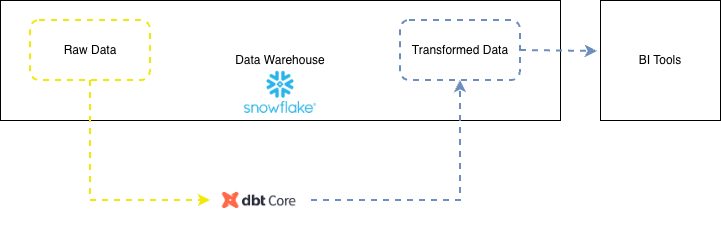

# Data Engineering for Beginners 



# Setup

# dbt — Installation & Usage

This README explains how to install dbt locally and run basic dbt commands (including the Snowflake adapter).

**Prerequisites**
- Python 3.8 or newer
- pip
- git

---

## Recommended: Install with pipx (isolated)

1. Install pipx (if you don't have it):

```bash
python3 -m pip install --user pipx
python3 -m pipx ensurepath
# Restart your shell or run: exec $SHELL
```

2. Install dbt for Snowflake using pipx:

```bash
pipx install "dbt-snowflake"
```

This installs `dbt` and the `dbt-snowflake` adapter in an isolated environment.

---

## Alternative: Install in a virtual environment

```bash
python3 -m venv .venv
source .venv/bin/activate
pip install --upgrade pip
pip install dbt-snowflake
```

---

## Quick Homebrew (macOS) option

```bash
brew install dbt
# or if you need a specific adapter, prefer pipx or venv install
```

Note: adapter packaging and Homebrew taps may change; prefer pipx for reproducibility.

---

## Configure your Snowflake connection (profiles.yml)

Create or update `~/.dbt/profiles.yml` with your Snowflake credentials. Example:

```yaml
my_profile:
  target: dev
  outputs:
    dev:
      type: snowflake
      account: <your_account>
      user: <your_user>
      password: <your_password>
      role: <your_role>
      database: <your_database>
      warehouse: <your_warehouse>
      schema: <your_schema>
      threads: 1
      client_session_keep_alive: False
```

Replace the placeholders with your Snowflake values. For secure secrets, use environment variables and a secrets manager rather than committing passwords.

---

## Initialize a dbt project

```bash
dbt init my_dbt_project
cd my_dbt_project
```

This creates a starter project and a `dbt_project.yml` file.

---

## Common dbt commands

- Check connection and profile:

```bash
dbt debug
```

- Run all models:

```bash
dbt run
```

- Run a specific model:

```bash
dbt run --select path.to.model or --select model_name
```

- Run tests:

```bash
dbt test
```

- Compile SQL without running:

```bash
dbt compile
```

- Generate documentation and serve locally:

```bash
dbt docs generate
dbt docs serve
```

- Seed CSV data (if using `data` files):

```bash
dbt seed
```

---

## Example workflow

1. Edit or add models in `models/`.
2. Run `dbt run` to build models in Snowflake.
3. Run `dbt test` to validate data tests.
4. Use `dbt docs generate` and `dbt docs serve` to inspect docs.

---

## Troubleshooting

- If `dbt` command is not found after pipx install, ensure pipx's binary path is on your `PATH` (run `python3 -m pipx ensurepath` and restart your shell).
- Use `dbt debug` to surface profile or connection issues.

---

## Further reading
- Official docs: https://docs.getdbt.com/
- Snowflake adapter: https://docs.getdbt.com/docs/available-adapters/snowflake

